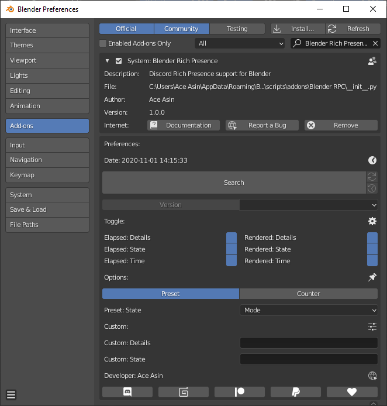

# **Blender - Discord Rich Presence (Add-On)**

## **Library**

## **Documentation**

* **Support**
  * Developer: [Ace Asin](https://discord.com/users/373656777671311360)
  * Server: [Ace Asin](https://discord.gg/U8vHS7y)

* **Blender**
  * 2.80+

* **Toggle**
  * Elapsed: Details - Toggle option for details.
  * Elapsed: State - Toggle option for state.
  * Elapsed: Time - Toggle option for duration.
  * Rendered: Details - Toggle option for details.
  * Rendered: State - Toggle option for state.
  * Rendered: Time - Toggle option for duration.
  <!-- * Button: 1 - Toggle option for the first button. -->
  <!-- * Button: 2 - Toggle option for the second button. -->

* **Custom**
  * Custom: Details - Custom details with optional variables.
  * Custom: State - Custom state with optional variables.
  * Custom: Large - Custom large image hover text with optional variables.
  * Custom: Small - Custom small image hover text with optional variables.
  <!-- * Custom: Button 1 - Custom button label and url. -->
  <!-- * Custom: Button 2 - Custom button label and url. -->

* **Option**

  

  
Variable

  * `{Discord}` - Display the discord server invite.

  ---
  * `{Project}` - Display the project name.

  ---

  * `{Build}` - Display the current build.
  * `{Version}` - Display the current version.

  ---

  * `{Object}` - Display the active object name.
  * `{Mode}` - Display the active object mode.
  * `{Type}` - Display the active object type.

  ---

  * `{Actions}`
  * `{Armatures}`
  * `{Brushes}`
  * `{Cache Files}`
  * `{Cameras}`
  * `{Collections}`
  * `{Curves}`
  * `{Fonts}`
  * `{Grease Pencils}`
  * ~~`{Hairs}`~~ (2.90+)
  * `{Images}`
  * `{Lattices}`
  * `{Libraries}`
  * `{Lightprobes}`
  * `{Lights}`
  * `{Linestyles}`
  * `{Masks}`
  * `{Materials}`
  * `{Meshes}`
  * `{Metaballs}`
  * `{Movieclips}`
  * `{Node Groups}`
  * `{Objects}`
  * `{Paint Curves}`
  * `{Palettes}`
  * `{Particles}`
  * ~~`{Pointclouds}`~~ (2.90+)
  * `{Scenes}`
  * `{Screens}`
  * `{Shape Keys}`
  * ~~`{Simulations}`~~ (2.90+)
  * `{Sounds}`
  * `{Speakers}`
  * `{Texts}`
  * `{Textures}`
  * `{Volumes}` (2.83+)
  * `{Window Managers}`
  * `{Workspaces}`
  * `{Worlds}`

  

  ---

  

  
Object

  * Active Object Name

  

  ---

  

  
Mode

  * Object Mode
  * Edit Mode
  * Pose Mode
  * Sculpt Mode
  * Vertex Paint
  * Weight Paint
  * Texture Paint
  * Particle Edit
  * Edit Grease Pencil Strokes
  * Sculpt Grease Pencil Strokes
  * Paint Grease Pencil Strokes
  * Grease Pencil Weight Paint Strokes

  

  ---

  

  
Type

  * Mesh
  * Curve
  * Surface
  * Meta
  * Font
  * Armature
  * Lattice
  * Empty
  * Grease Pencil
  * Camera
  * Light
  * Speaker
  * Light Probe

  

  ---

  

  
Counter

  * Actions
  * Armatures
  * Brushes
  * Cache Files
  * Cameras
  * Collections
  * Curves
  * Fonts
  * Grease Pencils
  * ~~Hairs~~ (2.90+)
  * Images
  * Lattices
  * Libraries
  * Lightprobes
  * Lights
  * Linestyles
  * Masks
  * Materials
  * Meshes
  * Metaballs
  * Movieclips
  * Node Groups
  * Objects
  * Paint Curves
  * Palettes
  * Particles
  * ~~Pointclouds~~ (2.90+)
  * Scenes
  * Screens
  * Shape Keys
  * ~~Simulations~~ (2.90+)
  * Sounds
  * Speakers
  * Texts
  * Textures
  * Volumes (2.83+)
  * Window Managers
  * Workspaces
  * Worlds

  

## **Installation**

<!-- * **Automatic**
  * Go to the "[Releases](https://github.com/AceAsin/BlenderRPC/releases)" tab on this page.
  * Download the latest .bat file.
  * Run the .bat file as an Administrator.
  * Enable and modify the settings if you wish. -->

* **Manual**
  * Go to the '[Releases](https://github.com/AceAsin/BlenderRPC/releases)' tab on this page.
  * Download the latest .zip folder.
  * Install the .zip folder as a Blender Add-on.
  * Enable and modify the settings if you wish.
